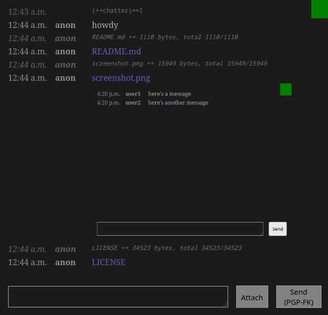

# Creamy Chat

<p align="center">
    
    <p align="center">Simple JSONL Chat Server</p>
    <p align="center">
        <a href="https://github.com/AlbinoDrought/creamy-chat/blob/master/LICENSE"></a>
    </p>
</p>

## Screenshots



## Usage

Run:

```
docker run \
  --rm \
  -p 3000:3000 \
  ghcr.io/albinodrought/creamy-chat:latest
```

Visit http://localhost:3000/

Usernames will be loaded from basic auth if provided.

For more debugging output, run with `CREAMY_CHAT_DEBUG=1`

To use client-side OpenPGP in fixed-key / password mode, add the URL hash `#f-somefixedkeyhere`, like `http://localhost:3000/#f-somefixedkeyhere`

## Building

### With Docker

`docker build -t ghcr.io/albinodrought/creamy-chat:latest .`

### Without Docker

`go get && go build`

## Threat Model

The source code and compiled application available here are artistic works of boredom and ignorance. Only a fool would believe anything transmitted is secure.
